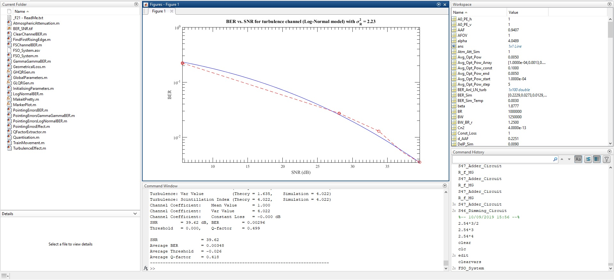

# FSO system simulation in MATLAB

Writer: Mojtaba Mansour Abadi

This simulation code uses the models and simulation MATLAB code from my PhD thesis.
Description: This code is simulating a free-space optical communication system. The simulation parameters are defined in 'GlobalParameters.m' file. The simulation can be done for various parameter sweeps. In the 'Main Loop' section you can follow the steps from generating random bits to extracting the bits from the received signal and calculating BER.
Due to an unkown memory error, instead of using function in the code, I have used a mechanism simula to MACRO definition in C/C++ language. Therefore, whenever needed, a sperate file containing the codes to perform a task is called with no argument/return values. This way all the variables defined in this file will be available to the code in the seperate file.

For more information about modesl refer to my thesis [A hybrid free space optics/radio frequency antenna - design and evaluation](http://nrl.northumbria.ac.uk/36012/) or [Optical Wireless Communications: System and Channel Modelling with MATLAB](https://uk.mathworks.com/academia/books/optical-wireless-communications-ghassemlooy.html).

